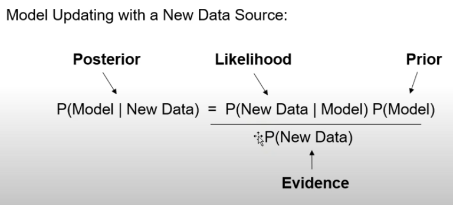
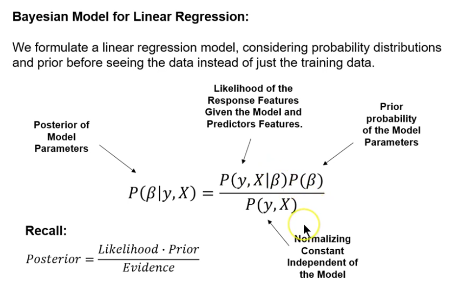

This is an [R Markdown](http://rmarkdown.rstudio.com) Notebook. When you execute code within the notebook, the results appear beneath the code. 

Try executing this chunk by clicking the *Run* button within the chunk or by placing your cursor inside it and pressing *Cmd+Shift+Enter*. 


```{r} 
# ANOVA following tutorial at: http://web.pdx.edu/~joel8/resources/ConceptualPresentationResources/JAGS_ANOVA.pdf

library(rjags)
library(lattice)
library(knitr)
library(dplyr) 
# library(kableExtra)
# for nice display of inline code 
opts_chunk$set(echo=TRUE, comment='') 
# for nicely formatted tables 
options(knitr.table.format = "latex")

# generate data
mdat = list('grp'=gl(3,4), 'ngrp'=3, 'N'=12, 'y'=c(2,1,3,2, 2,6,2,2, 6,10,7,5))
# quick visualization of the data
disp.mdat = matrix(mdat$y,ncol=mdat$ngrp,
                   dimnames = list(paste('obs',1:(mdat$N/mdat$ngrp),sep=' '),
                                   paste('group',1:mdat$ngrp,sep=' '))) 

disp.mdat
```

#
#

```{r}
# specify the likelihood model
mt = ' model{
  for(i in 1:N){
  y[i] ~ dnorm(mu[i], err.prec) 
  mu[i] = alpha + beta[grp[i]]
  }
  err.prec ~ dgamma(1.0E-3,1.0E-3) rse = pow(err.prec,-.5)
  alpha ~ dnorm(0,1.0E-3)
  
  beta[1] = 0
  for(i in 2:ngrp){
  beta[i] ~ dnorm(0,1.0E-3) 
  }
}'
# compile the model in JAGS
ti = textConnection(mt)
cm = jags.model(ti, data=mdat, # model specification and data.
                n.chains=2, # two random walkers
                # initial values, one set per chain 
                inits=list(
                list('alpha'=0,'beta'=c(NA,.5,.5)),
                list('alpha'=2,'beta'=c(NA,1,5))),
                # burn-in/adaptation steps before we trust
                n.adapt = 1000, quiet=TRUE)
close(ti) # clean up
# run the chains longer 
update(cm,5000)

#### Monitoring the Postreriors
# track the progress of our walkers relative to our parameters of interest 
pos = coda.samples(cm, # our compiled model
                   # parameters of interest to monitor
                   variable.names=c('alpha','beta','rse'), 
                   n.iter=5000) # steps to follow
```

```{r Visualization}
xyplot(window(pos,start=5001,stop=10000))
```

```{r diagnostics using z-score differences}
geweke.diag(window(pos,start=5001,stop=10000))
```

```{r Reporting}

summary_table <- summary(window(pos,start=5001,stop=10000))$statistics
summary_table

print(' ')

# Hypothesis testing of parameters?
quantile_table <- summary(window(pos,start=5001,stop=10000))$quantiles
quantile_table
```

```{r compare to OLS}
# How does this compare to OLS?
summary(lm(y~grp,mdat))$coefficients
```


```{r}
# following tuturial at: http://www.jkarreth.net/files/bayes-cph_Tutorial-JAGS.pdf
library(R2jags)
# An example model file is given in:
model.file <- system.file(package = "R2jags", "model", "schools.txt") 
# data
J <- 8.0
y <- c(28.4,7.9,-2.8,6.8,-0.6,0.6,18.0,12.2)
sd <- c(14.9,10.2,16.3,11.0,9.4,11.4,10.4,17.6) 
jags.data <- list("y","sd","J")
jags.params <- c("mu","sigma","theta")
jags.inits <- function(){  
  list("mu"=rnorm(1),"sigma"=runif(1),"theta"=rnorm(J))
}
jagsfit <- jags(data=list("y","sd","J"), inits = jags.inits, jags.params, n.iter = 10, model.file = model.file)
```

Add a new chunk by clicking the *Insert Chunk* button on the toolbar or by pressing *Cmd+Option+I*.

When you save the notebook, an HTML file containing the code and output will be saved alongside it (click the *Preview* button or press *Cmd+Shift+K* to preview the HTML file). 

The preview shows you a rendered HTML copy of the contents of the editor. Consequently, unlike *Knit*, *Preview* does not run any R code chunks. Instead, the output of the chunk when it was last run in the editor is displayed.

